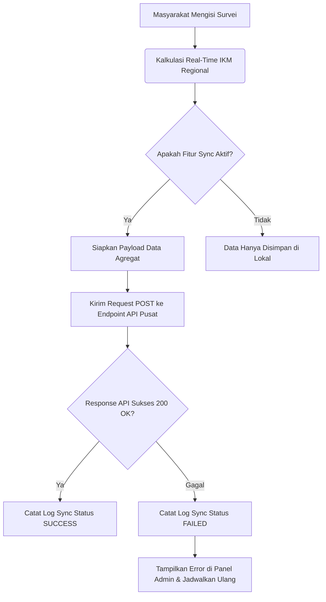

# SATUKAN - Integrasi Portal SKM Nasional

Dokumen ini menjelaskan alur sinkronisasi data Indeks Kepuasan Masyarakat (IKM) Daerah ke Portal SKM Nasional Kementerian PANRB sesuai regulasi Permen PANRB No.14 Tahun 2017.

---

## 🏛️ Standard Kepatuhan Permen PANRB No. 14 Tahun 2017

Kementerian Pendayagunaan Aparatur Negara dan Reformasi Birokrasi mewajibkan seluruh penyelenggara pelayanan publik mengukur indeks kepuasannya menggunakan 9 unsur layanan utama.

### Formula Perhitungan IKM

1. **Nilai Rata-Rata (NRR) per Unsur**:
   $$\text{NRR Unsur} = \frac{\text{Jumlah Nilai Unsur yang Terkumpul}}{\text{Jumlah Responden}}$$

2. **Skor IKM Tertimbang**:
   $$\text{Skor IKM Regional} = \left( \sum (\text{NRR Unsur} \times \text{Bobot}) \right) \times 25$$
   *Karena terdapat 9 unsur wajib dengan bobot seimbang, maka masing-masing unsur memiliki bobot sebesar $1/9 \approx 0.111$. Rumus sederhananya adalah:*
   $$\text{Skor IKM} = \text{Rata-rata NRR seluruh Unsur} \times 25$$

3. **Tabel Kategori Mutu & Nilai**:
   | Skor Hasil Konversi | Mutu Pelayanan | Kategori Kinerja |
   | :--- | :---: | :--- |
   | **88.31 - 100.00** | **A** | Sangat Baik |
   | **76.61 - 88.30** | **B** | Baik |
   | **65.00 - 76.60** | **C** | Kurang Baik |
   | **25.00 - 64.99** | **D** | Tidak Baik |

---

## 🔄 Alur Sinkronisasi Data Regional ke Pusat



### Format Payload Sinkronisasi
Payload yang dikirimkan ke server pusat memuat ringkasan performa regional, bukan data pribadi responden, demi menjaga kerahasiaan identitas:
```json
{
  "regional_code": "7300",
  "regional_name": "Pemerintah Kabupaten Satukan",
  "timestamp": "2026-06-24T15:30:00Z",
  "total_respondents": 420,
  "ikm_score": 82.50,
  "grade": "B",
  "grade_label": "Baik",
  "lowest_indicator": {
    "code": "U3",
    "name": "Waktu Penyelesaian",
    "score": 3.05
  },
  "highest_indicator": {
    "code": "U4",
    "name": "Biaya/Tarif",
    "score": 3.90
  },
  "indicators": {
    "U1": { "code": "U1", "name": "Persyaratan", "nrr": 3.32, "nrr_weighted": 0.369 },
    "U2": { "code": "U2", "name": "Sistem, Mekanisme, dan Prosedur", "nrr": 3.20, "nrr_weighted": 0.355 },
    "U3": { "code": "U3", "name": "Waktu Penyelesaian", "nrr": 3.05, "nrr_weighted": 0.339 },
    "U4": { "code": "U4", "name": "Biaya/Tarif", "nrr": 3.90, "nrr_weighted": 0.433 },
    "U5": { "code": "U5", "name": "Produk Spesifikasi Jenis Pelayanan", "nrr": 3.40, "nrr_weighted": 0.377 },
    "U6": { "code": "U6", "name": "Kompetensi Pelaksana", "nrr": 3.35, "nrr_weighted": 0.372 },
    "U7": { "code": "U7", "name": "Perilaku Pelaksana", "nrr": 3.42, "nrr_weighted": 0.380 },
    "U8": { "code": "U8", "name": "Penanganan Pengaduan, Saran dan Masukan", "nrr": 3.10, "nrr_weighted": 0.344 },
    "U9": { "code": "U9", "name": "Sarana dan Prasarana", "nrr": 3.25, "nrr_weighted": 0.361 }
  }
}
```

---

## 🪵 Mekanisme Monitoring & Error Logging

1. **National Sync Logs (`national_sync_logs`)**:
   Setiap kali sinkronisasi (baik otomatis atau manual) dipicu, sistem mencatat riwayat ke tabel log. Log ini dapat dipantau langsung pada menu **Sinkronisasi Nasional** di panel Superadmin.
   
2. **Kepatuhan Validasi Unsur**:
   Sebelum data dipush ke portal nasional, validator internal (`IkmCalculator`) memverifikasi bahwa seluruh 9 unsur wajib Permen PANRB No. 14 Tahun 2017 telah dijawab oleh responden. Jika ada data yang tidak lengkap, sistem akan menolak pengiriman untuk mencegah penolakan format dari server pusat.
